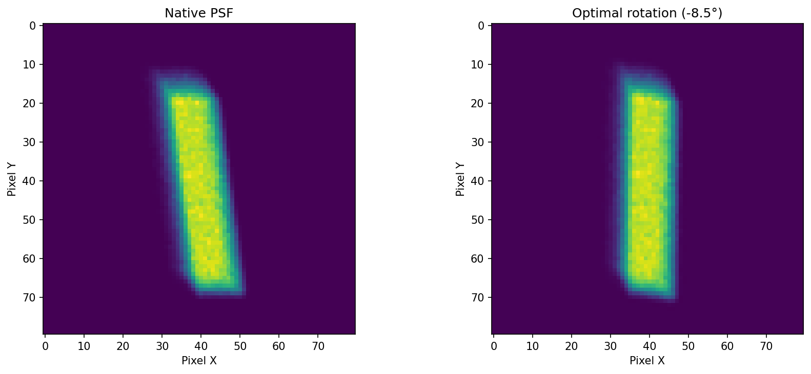
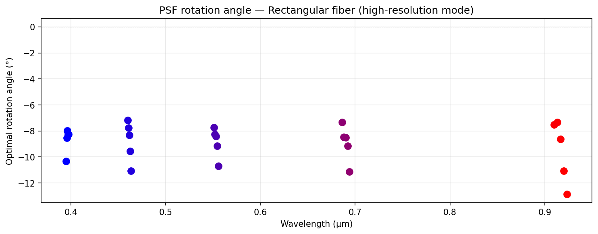

# VROOMM v04 — Image Quality Analysis

Spectral image quality analysis for the **VROOMM spectrograph** (v04 optical design), comparing two fiber configurations:

| Mode | Fiber | Description |
|------|-------|-------------|
| **High-resolution** | Rectangular | Elongated slit image, optimized for radial-velocity precision |
| **Low-resolution** | Octagonal | Circular PSF, no slit tilt correction needed |

The analysis covers 5 diffraction orders (67, 89, 111, 133, 155) spanning **0.39–0.92 µm**, with 5 field positions per order (25 PSFs per fiber type, 50 total).

---

## PSF Rotation (Rectangular Fiber)

The rectangular slit produces a PSF that is tilted on the detector due to spectrograph anamorphism and grating geometry. Before extracting the Line Spread Function (LSF), each PSF is rotated to align the dispersion direction with the pixel columns.

The optimal angle maximizes the sum of squared gradients of the column-summed profile — effectively maximizing the sharpness of the extracted LSF.



The tilt angle varies across the focal plane as a function of wavelength and order:



---

## Resolving Power

The resolving power $R = c / \Delta v$ is measured using two methods:

### 1. Gaussian Equivalent FWHM (Bouchy et al. 2001)

Following [Bouchy, Pepe & Queloz (2001, A&A, 374, 733)](https://ui.adsabs.harvard.edu/abs/2001A%26A...374..733B), we find the Gaussian whose:
- **Integral** matches the observed LSF flux
- **Sum of squared gradients** matches the LSF (proportional to the radial-velocity information content $Q$)

This is *not* a least-squares fit — it finds the Gaussian with equivalent RV information content. The FWHM of this Gaussian is the relevant width for RV precision estimates ($\sigma_{\rm RV} \propto \mathrm{FWHM}^{3/2}$).

### 2. Direct FWHM

Simple half-maximum interpolation on the LSF profile. A robust geometric measurement, but less informative for RV science since it ignores the wing structure.

### Local Dispersion

The velocity scale (km/s per pixel) is computed from the Zemax `_XY.txt` file, which provides wavelength and detector position for each field point. The derivative $d\lambda/dx$ is converted to velocity dispersion:

$$\text{disp} = c \times \frac{|d\lambda/dx|}{\lambda} \quad [\text{km/s/pixel}]$$

with 12 µm detector pixels and Zemax simulations at 4× oversampling.


---

## File Structure

```
VROOMM_v04_rectangular_fiber/       # High-resolution mode PSFs
    R{order}{1-5}.txt               # 80×80 Zemax ASCII maps (e.g., R1554.txt)
    VROOMM_v04_rectangular_fiber_XY.txt  # Order, wavelength, x, y positions

VROOMM_v04_octogonal_fiber/         # Low-resolution mode PSFs
    R{order}{1-5}.txt
    VROOMM_v04_octogonal_fiber_XY.txt

read_zemax_map.py                   # Analysis pipeline (this code)
```

### Zemax ASCII Format

Each `R*.txt` file contains:
- **17-line header**: Zemax metadata (ray trace config, field/image widths, pixel count)
- **80 × 80 data block**: Tab-separated flux values in scientific notation

### XY File Format

Each `_XY.txt` file has 25 rows (5 orders × 5 positions):

| Column | Content |
|--------|---------|
| 0 | Diffraction order (67, 89, 111, 133, 155) |
| 1 | Wavelength (µm) |
| 2 | x position on detector (mm) |
| 3 | y position on detector (mm) |

---

## Usage

```bash
python read_zemax_map.py
```

This runs the full pipeline:
1. Reads all 50 PSFs (25 per fiber type)
2. Finds optimal rotation angles (rectangular fiber only)
3. Extracts 1D LSF profiles
4. Computes Gaussian equivalent and direct FWHM
5. Converts to resolving power using local dispersion
6. Generates three PNG plots

### As a library

```python
from read_zemax_map import read_zemax_map, rotate_psf, find_optimal_rotation, match_gaussian_to_lsf, measure_fwhm

# Read a single PSF
psf = read_zemax_map('VROOMM_v04_rectangular_fiber/R1554.txt')

# Find optimal rotation and extract LSF
angle = find_optimal_rotation(psf)
psf_rot = rotate_psf(psf, angle)
lsf = psf_rot.sum(axis=0)

# Gaussian equivalent (Bouchy 2001)
result = match_gaussian_to_lsf(lsf)
print(f"FWHM = {result['fwhm']:.2f} sim pixels")

# Direct FWHM
fwhm_direct = measure_fwhm(lsf)
```

---

## Dependencies

- Python ≥ 3.10
- NumPy
- Matplotlib
- SciPy
